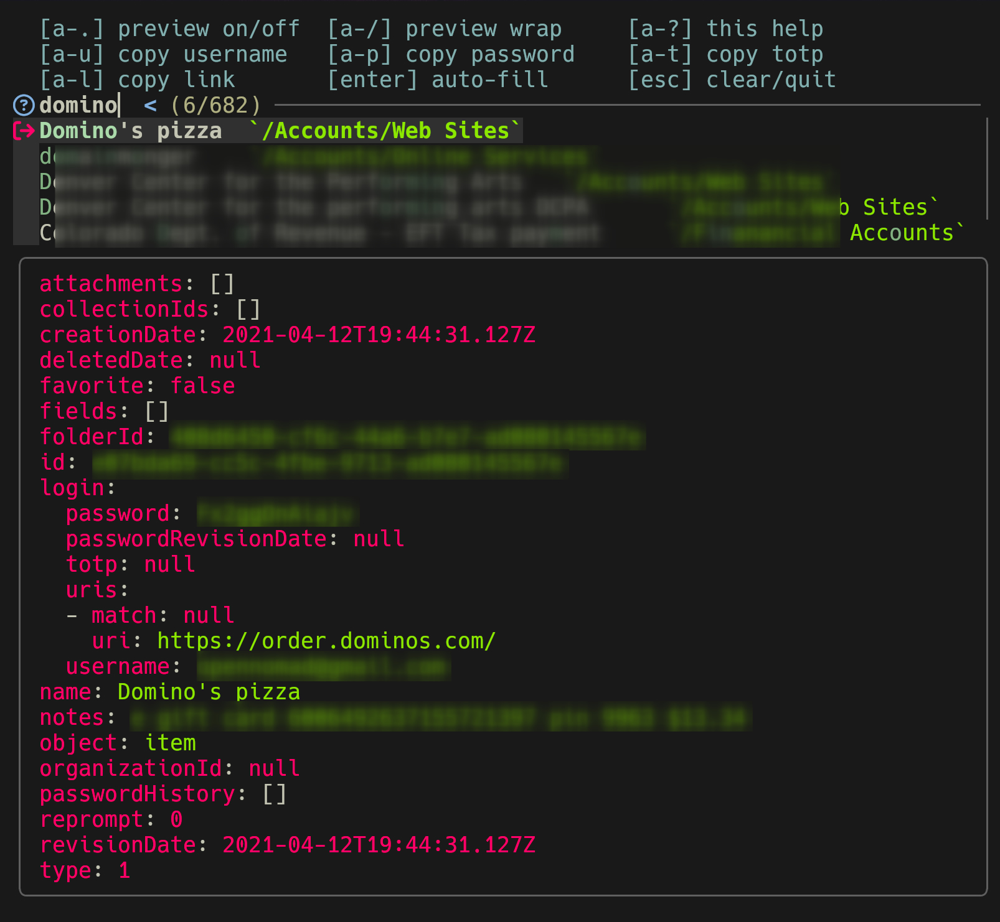

# bwzy - bitwarden ... fuzzy

bwzy is a fuzzy finder and auto-filler for Bitwarden (read-only at present).
It runs in the terminal and uses the official bitwarden CLI.



# current features
    - terminal UI 
- more user-friendly than the `bw` command line client
- search based on name and folder
- hide based on name (i.e. "hide archives")
- copy user/pass/totp
- local cache for speed
- refresh/flush cache
- preview items in `YAML` form
- auto-fill (currently working in hyprland)
- one-shot mode for use in scripts

# requirements

The following software is needed by `bwzy`:

- [bitwarden cli client](https://contributing.bitwarden.com/getting-started/clients/cli) to access bitwarden
- [fzf](https://junegunn.github.io/fzf/) for fuzzy finding
- [jq](https://jqlang.github.io/jq/) to work with the JSON
- [OATH Toolkit](https://www.nongnu.org/oath-toolkit/) allows generating TOTP tokens
- [charmbracelet - gum](https://github.com/charmbracelet/gum) for the loading spinner and color

It also expects `grep`, `sed` and `awk` to be available

Additionally, you will need clipboard and keyboard automation such as `wtype` and `wl-copy` under wayland.

## configuration

All configuration is done via environment variables, with defaults shown

```bash
# functional settings
BWZY_CACHE=`/dev/shm/bwzy-cache`           # where the passwords are cached
BWZY_KEEP_CACHE='true'                     # set to false and cache will be purged on exit
BWZY_COPY_CMD='wl-copy'                    # the command to copy something to the clipboard
BWZY_TYPE_CMD='wtype'                      # the command used to type / send keyboard events
BWZY_HIDE_CMD=''                           # the command to hide bwzy.desktop or a terminal named `bwzy`
BWZY_REFOCUS_CMD=''                        # the command to refocus the previous window
BWZY_COPY_AND_HIDE='true'                  # set to 'false' to not hide bwzy on copy - does not affect auto-fill
BWZY_NOTIFY_CMD='notify-send -i bitwarden' # send a notification (optional, but nice to know if a TOTP has been copied)
BWZY_FILTER="-zz~ "                        # exclude items with this string in name of folder

# cosmetic overrides which adjust the looks
BWZY_USER_SYMBOL='u+'    # new prompt on user copy
BWZY_PASS_SYMBOL='p+'    # new prompt on password copy
BWZY_TOTP_SYMBOL='t+'    # new prompt on TOTP copy
BWZY_LINK_SYMBOL='l+'    # new prompt on link copy
BWZY_AUTO_SYMBOL='a+'    # new prompt on auto-fill 
BWZY_FOLDER_SYMBOL='/'   # new symbol used for a folder
BWZY_POINTER_SYMBOL='> ' # the line marker used by FZF 
BWZY_PROMPT_SYMBOL='? '  # the prompt symbol used by FZF 
```

`bwzy` is being tested as my daily driver under [Hyprland](https://hypr.land/) and [Wayland](https://wayland.freedesktop.org/) only, but may be adaptable by the intrepid adventurer. The configuration items to look at are:

- `BWZY_COPY_CMD`
- `BWZY_TYPE_CMD`
- `BWZY_HIDE_CMD`
- `BWZY_REFOCUS_CMD`
- `BWZY_COPY_AND_HIDE`
- `BWZY_NOTIFY_CMD`

Note: under [hyprland](https://hypr.land/) the following works:
```bash
BWZY_HIDE_CMD=hyprctl dispatch movetoworkspacesilent special:tools,title:bwzy
BWZY_REFOCUS_CMD=hyprctl dispatch focuscurrentorlast
```

This hides the bwzy window, a terminal window with the title set to `bwzy`, to a special workplace. A shortcut defined in my window manager brings that window to the foreground.

The [bwzy.desktop](./bwzy.desktop) file shows the way I launch it.

If you have a font and terminal with support for unicode, you can use fancy symbols. Here are mine:

```bash
BWZY_USER_SYMBOL=' '
BWZY_PASS_SYMBOL=' '
BWZY_AUTO_SYMBOL=' '
BWZY_TOTP_SYMBOL=' '
BWZY_LINK_SYMBOL=' '
BWZY_FOLDER_SYMBOL='/'
BWZY_POINTER_SYMBOL=' '
BWZY_PROMPT_SYMBOL=' '
```

# tips and tricks

By default the cache is removed on reboot since it lives in `/dev/shm/`. If you have a secure encrypted file system you can override the cache location so that it persists during reboots. I use this often as I'm often completely offline, but still need access to my passwords for offline work. Be safe and know your risks. 

# feature ideas
- ~~auto-fill~~ (done)
- ~~"archive" feature to filter things~~ (done)
- edit an entry
- add a new entry
- folder based navigation (as in select from list of folders)
